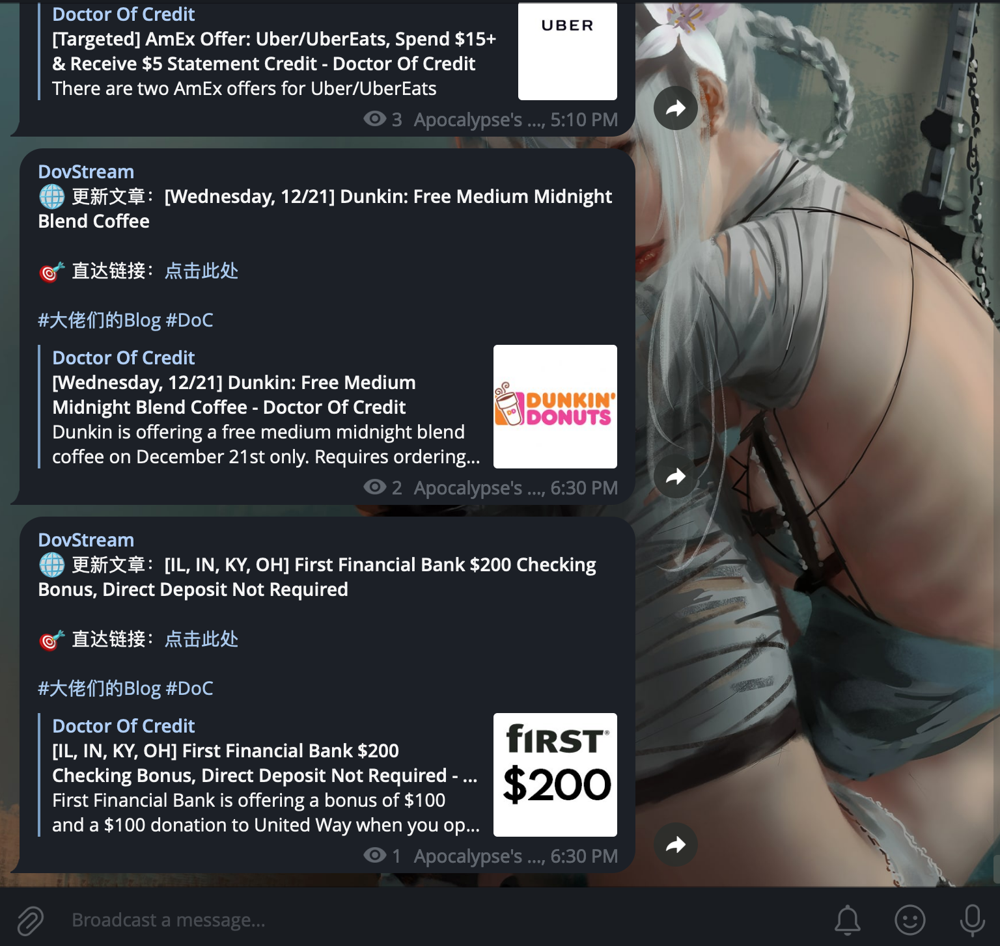

# Formatted RSS to Telegram

A highly customizable, production-ready RSS to Telegram bot with persistent message queue, rate limiting, and advanced content processing capabilities.



## Features

### Core Features

- **Persistent Message Queue** - SQLite-backed queue with automatic crash recovery
- **Rate Limiting** - Sequential message processing with configurable delay (p-queue)
- **First Run Detection** - Silently saves history on initial setup to avoid flooding
- **Queue Monitoring** - Track pending task count in real time
- **Auto Cleanup** - Periodic cleanup of completed tasks and expired history

### Content Processing

- **Media Embedding** - Automatic image/video extraction from RSS content
- **Template Engine** - Nunjucks-powered message templates
- **Content Filtering** - Regex-based include/exclude filters with remote URL support
- **Remote Filter Lists** - Fetch filter patterns from URLs with optional function transforms
- **Content Rules** - Transform RSS fields with regex or custom functions

### Network & Proxy

- **Proxy Support** - HTTP/HTTPS proxy with authentication (via Bun native fetch)
- **Cloudflare Bypass** - FlareSolverr integration for protected feeds
- **Intranet Detection** - Automatic proxy bypass for local network feeds

### Monitoring & Reliability

- **RSS Monitoring** - Telegram notifications for invalid/expired RSS links
- **Structured Logging** - Winston-based logging with daily rotation
- **Database Persistence** - All tasks and history stored in SQLite
- **Type Safety** - Full TypeScript with Zod schema validation

## Quick Start

### Docker (Recommended)

1. **Install Docker**

2. **Create `docker-compose.yaml`:**

   ```yaml
   services:
     fr2t:
       image: ghcr.io/apocalypsor/fr2t
       container_name: fr2t
       restart: always
       volumes:
         - ./data:/app/config
         - ./logs:/app/logs
   ```

3. **Configure RSS and Bot:**
   - Copy sample configs from [docs](./docs) to `./data/`
   - Create `./data/config.yaml` (see [Configuration](#configuration))
   - Create `./data/rss.yaml` (see [RSS Configuration](#rss-configuration-rssyaml))

4. **Start the service:**
   ```bash
   docker-compose up -d
   ```

### Local Development

1. **Prepare Configuration:** Ensure `./config/config.yaml` and `./config/rss.yaml` exist. You can copy the samples from `./docs/` (e.g., `cp ./docs/config_sample.yaml ./config/config.yaml`) and update them with your credentials.

2. **Run the application:**
   ```bash
   # Install Bun (if not installed)
   curl -fsSL https://bun.sh/install | bash

   # Install dependencies
   bun install

   # Start development server with hot reload
   bun run dev

   # Run production
   bun start
   ```

## Configuration

### Bot Configuration (`config.yaml`)

```yaml
# Cleanup interval (days)
expireTime: 30

# RSS check interval (minutes)
interval: 10

# User agent for RSS requests
userAgent: Mozilla/5.0 (Windows NT 10.0; Win64; x64) AppleWebKit/537.36

# FlareSolverr endpoint (optional)
flaresolverr: http://127.0.0.1:8191/

# Telegram chat ID for RSS monitoring notifications (optional)
notifyTelegramChatId: 111111111

# Proxy configuration (optional)
proxy:
  enabled: true
  protocol: http # http or https
  host: 127.0.0.1
  port: 1080
  auth:
    username: user
    password: pass

# Telegram bot configuration (required)
telegram:
  - name: default
    token: YOUR_BOT_TOKEN
    chatId: YOUR_CHAT_ID
    # Optional, default is Markdown. Accepted: Markdown, MarkdownV2, HTML, RichHTML.
    # Markdown is rendered and sent as MarkdownV2 for new messages.
    parseMode: MarkdownV2
    disableNotification: false
    disableWebPagePreview: false
```

### RSS Configuration (`rss.yaml`)

```yaml
rss:
  - name: GitHub Commits
    url: https://github.com/user/repo/commits.atom
    sendTo: default # or list: [bot1, bot2]

    # Optional settings
    disableNotification: false
    disableWebPagePreview: false
    fullText: true
    embedMedia: true
    embedMediaExclude:
      - https://example.com/.+

    # Content transformation rules
    rules:
      - obj: title
        type: regex # or func
        matcher: ^(\[.+?\])?(.+?)$
        dest: tag

      - obj: content
        type: func
        matcher: |
          return obj.replace(/pattern/, 'replacement');
        dest: processed_content

    # Content filters
    filters:
      # Static regex filter
      - obj: title
        type: in # include only matching
        matcher: important

      - obj: content
        type: out # exclude matching
        matcher: spam|ads

      # Remote filter: fetch URL content as regex
      - obj: author
        type: out
        matcher:
          url: https://example.com/blocklist.txt

      # Remote filter with function transform
      - obj: author
        type: out
        matcher:
          url: https://example.com/blocklist.json
          func: |
            const list = JSON.parse(data);
            return list.users.map(u => u.username).join('|');

    # Message template (Nunjucks)
    text: |
      **{{ title }}**

      {{ content }}

      [Read more]({{ link }})

      _Tags: {{ tag }}_
```

#### Rich HTML messages

`parseMode` on a sender is the default for every feed sent through that sender.
Set `parseMode: RichHTML` on an individual RSS entry to override that default
for just that feed. RichHTML sends a `rich_message` instead of Telegram's
standard text or media request.

```yaml
rss:
  - name: Rich Article Feed
    url: https://example.com/feed.xml
    sendTo: default
    parseMode: RichHTML
    embedMedia: true
    embedMediaExclude:
      - https://example.com/images/emoji/.+
    text: |
      <h1>{{ title }}</h1>
      <p><a href="{{ link }}">Read the original article</a></p>
      {{ rich_content | safe }}
      <footer>#{{ rss_name | replace(" ", "_") }}</footer>
```

In RichHTML templates, ordinary fields such as `title` and `link` are
HTML-escaped. `rich_content` contains application-sanitized article HTML and
must be inserted with `{{ rich_content | safe }}` to preserve its markup.
RichHTML templates are HTML templates: Markdown in the template is not
converted to HTML.

When `embedMedia` is enabled for a RichHTML feed, eligible article media is
included inline in `rich_content`; `embedMediaExclude` filters matching media
URLs. RichHTML does not send a separate photo, video, or media-group request.
`disableWebPagePreview` has no effect on `sendRichMessage`.

### Available Template Variables

From RSS feed (via [rss-parser](https://github.com/rbren/rss-parser)):

- `title`, `link`, `content`, `contentSnippet`
- `author`, `pubDate`, `guid`
- Any custom fields from your RSS feed

Custom variables:

- `rss_name` - Name of the RSS feed
- `rss_url` - URL of the RSS feed
- Any fields created by `rules` (e.g., `tag`, `processed_content`)

## License

Apache-2.0 License - see [LICENSE](LICENSE) for details.

## Acknowledgments

- [rss-parser](https://github.com/rbren/rss-parser) - RSS feed parsing
- [Drizzle ORM](https://orm.drizzle.team/) - TypeScript ORM
- [Bun](https://bun.sh) - Fast JavaScript runtime
- [Nunjucks](https://mozilla.github.io/nunjucks/) - Template engine
- [ky](https://github.com/sindresorhus/ky) - HTTP client
- [p-queue](https://github.com/sindresorhus/p-queue) - Promise queue with concurrency control
